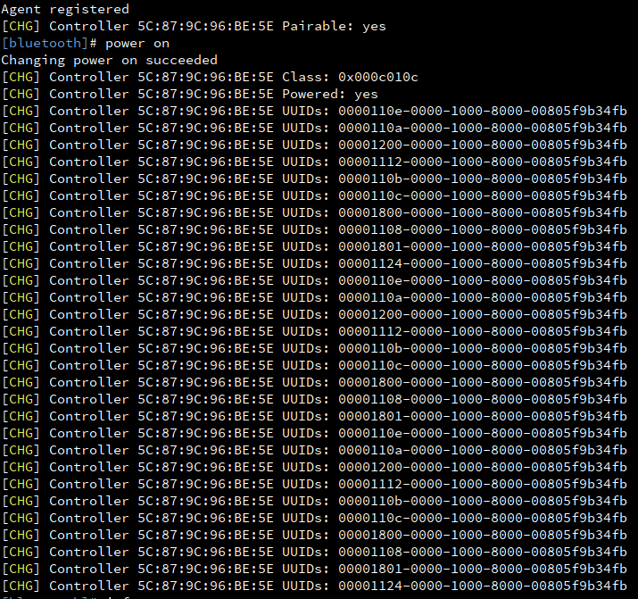
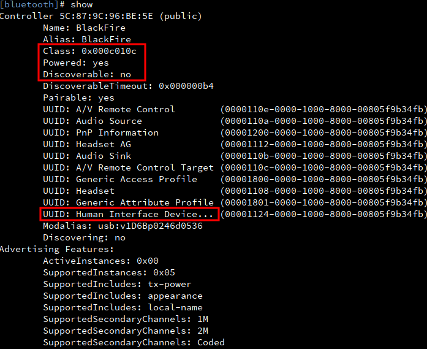
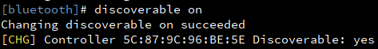
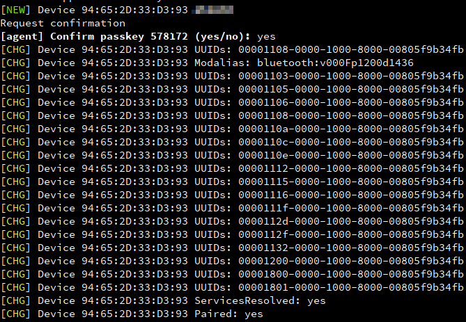
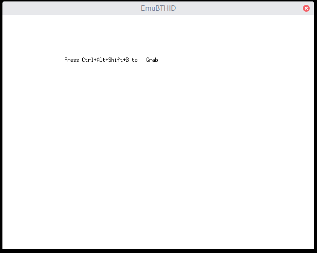
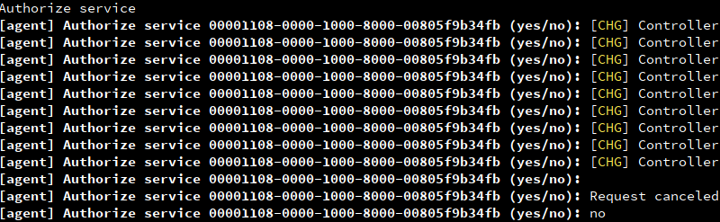

# EmuBTHID

## Description

This tool emulates a simple bluetooth HID device (keyboard + mouse) based on bluez and xserver from linux. It was orignally designed for a poor student cannot afford a bluetooth keyboard. That poor student used laptop keyboard/mouse to control an android phone via bluetooth.

Via bluez, EmuBTHID registers a special bluetooth service ("00001124-0000-1000-8000-00805f9b34fb") which can serve as a HID device and be discoverable by other users.

Via Xlib, EmuBTHID creates a X window, which grabs keyboard/mouse input and send them to remote.

This tool requires "root" to listen to priviledged bluetooth ports, which communicate with remote devices.

## Dependencies

This tool is recently tested under Archlinux:

kernel: 5.7.7

bluez: 5.54-2

xorg-server: 1.20.8


python libraries:

python-xlib 0.27
dbus-python 1.2.16


The client who uses the emulated HID device is an android 9 phone.

## How to Use

### (IMPORTANT) Update the bluetooth controller MAC in `main.py`

Edit `main.py` and change the `CONTROLLER_MAC` variable in the beginning to your own MAC. You can find the MAC of the bluetooth controller in `bluetoothctl`. E.g. the "5C:87:9C:96:BE:5E" shown in the screenshot below is the MAC.

### Enable bluetooth

1. make sure that bluetoothd has the plugin `input` disabled (i.e. "-P input").

    - For example, refer to [ArchWiki](https://wiki.archlinux.org/title/Systemd#Examples)
      ```
      sudo systemctl edit bluetooth
      ```
    - Then append the argument "-P input"
       ```
       ### Editing /etc/systemd/system/bluetooth.service.d/override.conf
       ### Anything between here and the comment below will become the contents >
       
       [Service]
       ExecStart=
       ExecStart=/usr/lib/bluetooth/bluetoothd -P input
       ```
    
    - Finally restart the modified bluetoothd
       ```
       sudo systemctl restart bluetooth
       ```
2. make sure that bluetooth service is running (systemctl status bluetooth)

3. enter `bluetoothctl` and do `power on`

4. make sure the bluetooth controller is not blocked by software (check rfkill or enable bluetooth in your desktop manager, e.g. gnome)

5. Run `xhost +` to enable root user also draw something on a non-root user's X session. (see [this stackoverflow](https://stackoverflow.com/questions/31902846/how-to-fix-error-xlib-error-displayconnectionerror-cant-connect-to-display-0))

6. Run `sudo python3 main.py`

In bluetoothctl, it should look like this, where a lot of UUIDs are registered



And you can find this specific `Class` value and UUID for a "Human Interface Device" appears in `show`



6. Now go back to bluetoothctl, enable discoverable

   

7. (unverified) [users](https://github.com/Alkaid-Benetnash/EmuBTHID/issues/7#issuecomment-1826289347) also reported that "pairable" might need to be explicitly enforced via bluetoothctl command `pairable on`. Just make sure in bluetoothctl you can see a message saying your controller `[CHG] Controller XX:XX:XX:XX:XX:XX Pairable: Yes`

8. Now you should be able to discover a new HID device on other devices (e.g. an android phone). Now pair or re-connect. You should finish the pairing procedure in bluetoothctl (there will be a prompt). It looks like this:

   

9. After a device is paired and connected, you should be able to see the main window of EmuBTHID which will capture your keyboard/mouse input:

   

9. Final step, go back to the main window. enter "Ctrl+Alt+Shift+B" as shown in the window to grab keyboard as well as mouse input. Press the same combination again to un-grab.

## Known Issues

1. The `xhost +` is pretty hacky and may raise security concerns. But I am personally fine with that.

2. After pairing or connecting to this emulated HID device, `bluetoothctl` will show a lot of authorize prompt, which I normally ignore.

   

3. Even though the keyboard usually works pretty well, the mouse sometimes becomes lagging. But I normally only use the keyboard feature.
